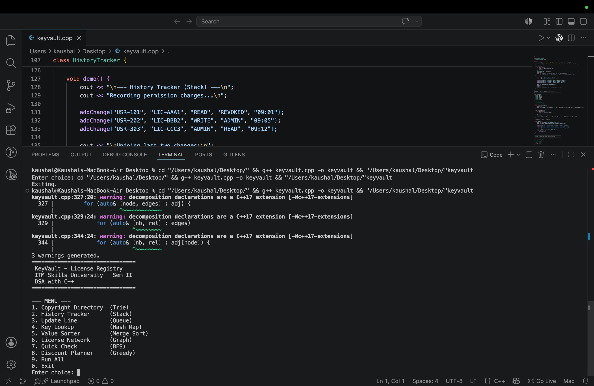
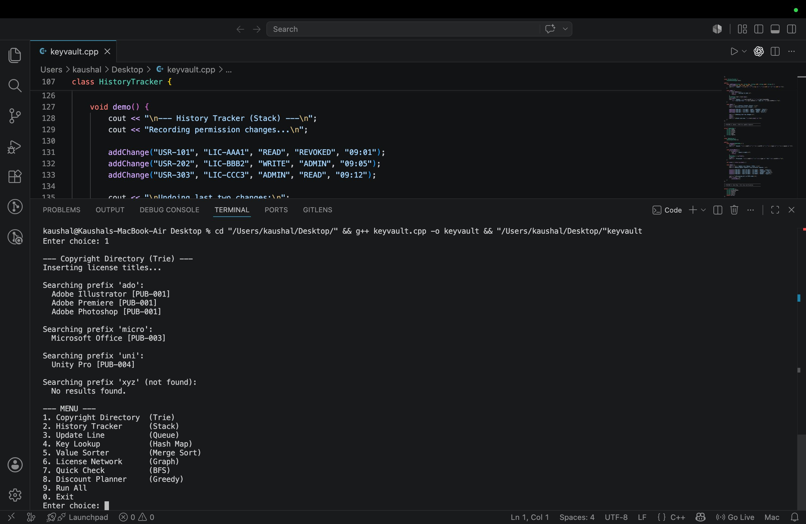
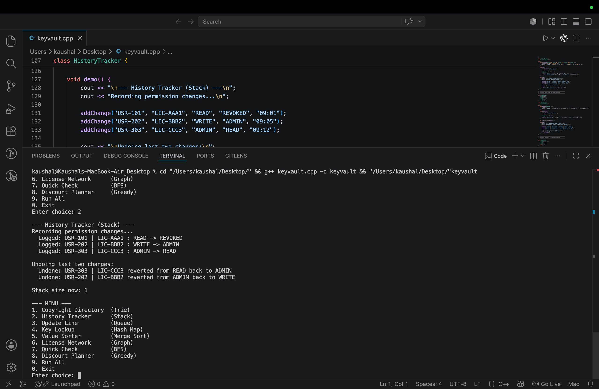
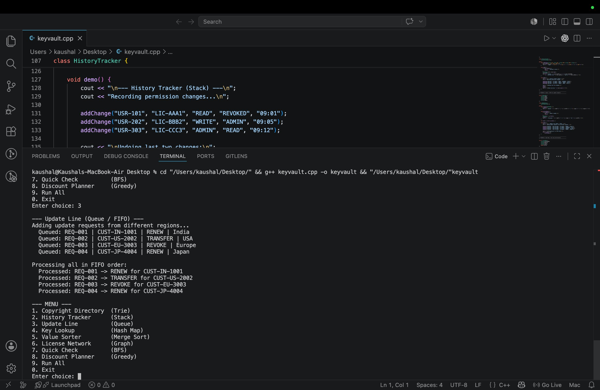
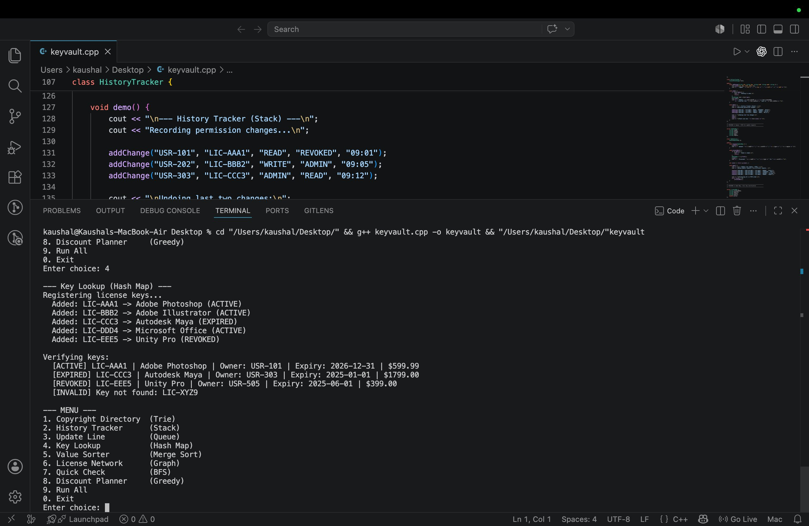
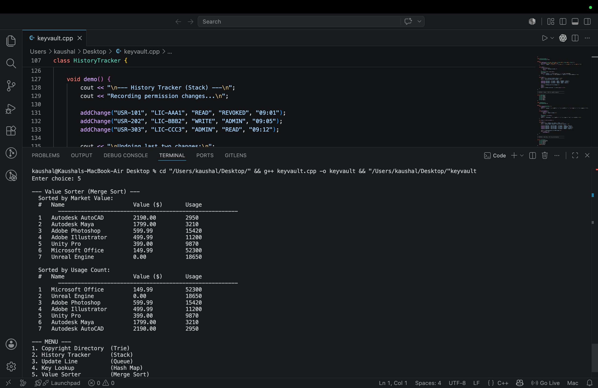
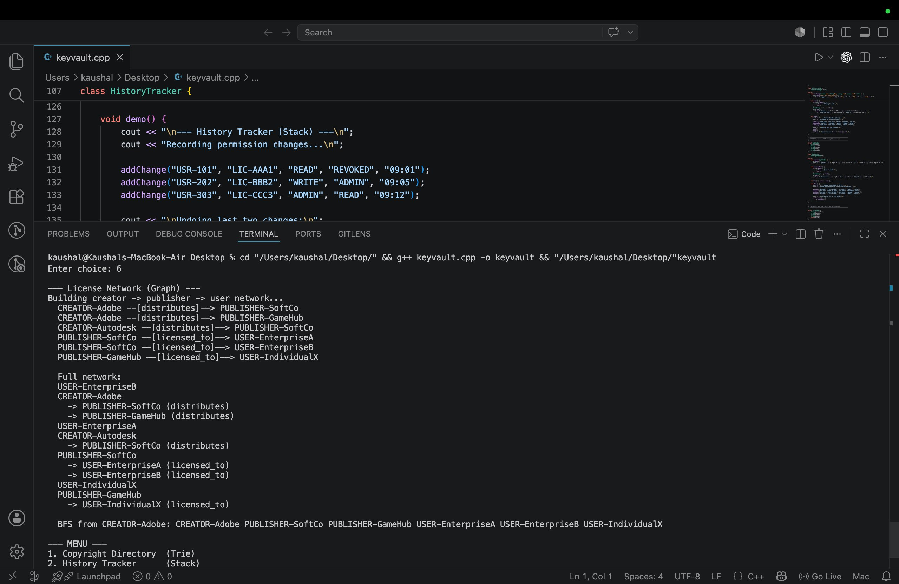
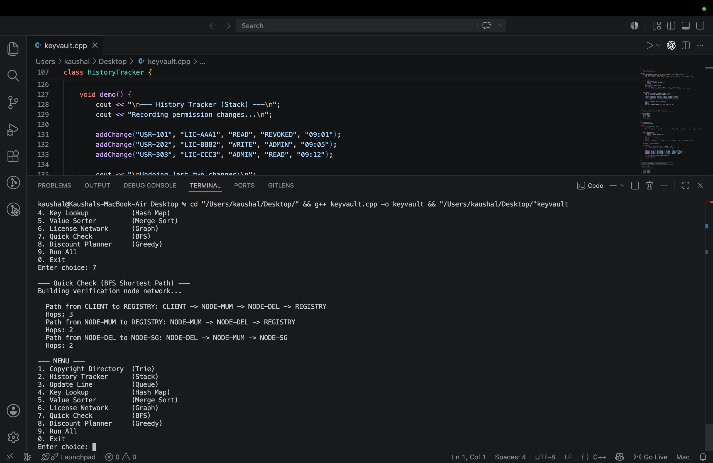
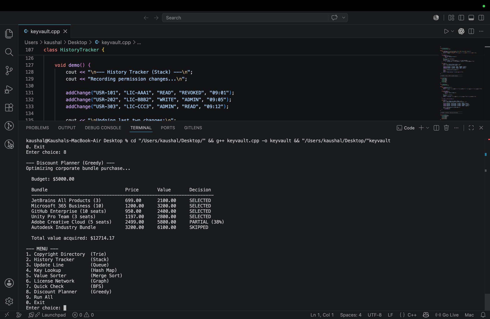

# KeyVault — Digital Intellectual Asset Registry

> **ITM Skills University | B.Tech CSE 2025-29 | Semester II Sprint 2 Examination**
> Course: Data Structures & Algorithms with C++
> Case Study 3: Digital Intellectual Asset Registry
> Student: Kaushal Rajmandai | Roll No: 150096725111
> GitHub: https://github.com/kaushalrajmandai/KeyVault

---

## 2.1 Project Title

**KeyVault** — A Digital Intellectual Asset Registry System for Online Software License Marketplaces

---

## 2.2 Problem Statement

KeyVault is an online marketplace for selling software licenses, similar to platforms that distribute antivirus keys or game activation codes. With millions of licenses from thousands of publishers, the system faces critical performance issues:

- Searching for a license by typing the first few characters is painfully slow
- When an admin accidentally revokes a user's access rights, there is no way to undo it instantly
- License update requests from around the world pile up but get processed in random order, causing unfair wait times
- Verifying whether a specific license key is genuine takes too long because the system checks every record one by one
- There is no clear picture of how licenses flow from creators to publishers to end users, making it impossible to audit royalty payments or detect piracy rings

---

## 2.3 Objectives

1. Implement a **Trie** for ultra-fast prefix-based license title search
2. Implement a **Stack** to maintain permission change history with instant undo capability
3. Implement a **Queue (FIFO)** to ensure fair, ordered processing of license update requests
4. Implement a **Hash Map** for O(1) license key verification
5. Implement **Merge Sort** to rank digital assets by market value or usage frequency
6. Implement a **Graph (Adjacency List)** to model the creator → publisher → user distribution network
7. Implement **BFS** to find the shortest license verification path
8. Implement a **Greedy Algorithm** (Fractional Knapsack) to optimize corporate bundle purchases

---

## 2.4 System Overview / Architecture

```
KeyVault System
│
├── Copyright Directory  ──► Trie               (Feature 1)
├── History Tracker      ──► Stack               (Feature 2)
├── Update Line          ──► Queue (FIFO)         (Feature 3)
├── Key Lookup           ──► Hash Map             (Feature 4)
├── Value Sorter         ──► Merge Sort           (Feature 5)
├── License Network      ──► Graph (Adj. List)    (Feature 6)
├── Quick Check          ──► BFS Shortest Path    (Feature 7)
└── Discount Planner     ──► Greedy Algorithm     (Feature 8)
```

All 8 modules are implemented in a single C++ file with a unified interactive menu. Each module is a self-contained class.

---

## 2.5 Data Structures and Algorithms Used

| Feature | Data Structure / Algorithm | Time Complexity | Real-world Analogy |
|---|---|---|---|
| Copyright Directory | Trie | O(L) search | Steam search bar |
| History Tracker | Stack (LIFO) | O(1) push/pop | Ctrl+Z in admin panel |
| Update Line | Queue (FIFO) | O(1) enqueue/dequeue | License activation queue |
| Key Lookup | Hash Map (unordered_map) | O(1) average | Windows product key check |
| Value Sorter | Merge Sort | O(n log n) | Top Sellers chart |
| License Network | Directed Graph (Adj. List) | O(V+E) traversal | Royalty flow tracking |
| Quick Check | BFS on Graph | O(V+E) | CDN nearest server routing |
| Discount Planner | Greedy (Fractional Knapsack) | O(n log n) | Volume licensing optimizer |

---

## 2.6 Implementation Approach

**Copyright Directory (Trie):** Each character of a license title is a node. Insertion traverses or creates one node per character. Prefix search navigates to the prefix endpoint then does a DFS to collect all matching titles.

**History Tracker (Stack):** Every permission change is pushed as a struct. Because the stack is LIFO, `undoLast()` always pops the most recent change and reverts it in O(1).

**Update Line (Queue):** Requests are enqueued on arrival and dequeued from the front. Guarantees that customers who requested first are served first regardless of region.

**Key Lookup (Hash Map):** License keys are stored in an `unordered_map`. Verification is a single hash lookup — O(1) average — instead of scanning all records.

**Value Sorter (Merge Sort):** Custom merge sort implemented from scratch. Parameterised to sort by market value or usage count, both descending.

**License Network (Graph):** Directed graph using adjacency list. Edges carry relationship labels (distributes, licensed_to). BFS from any creator shows the full IP distribution chain.

**Quick Check (BFS):** BFS finds the minimum-hop path between any two nodes. Parent pointers reconstruct the path after traversal.

**Discount Planner (Greedy):** Bundles sorted by value/price ratio. Greedy picks highest-ratio first until budget is exhausted. Fractional selection supported for the last bundle.

---

## 2.7 Time and Space Complexity Analysis

| Module | Operation | Time Complexity | Space Complexity |
|---|---|---|---|
| Trie | Insert | O(L) | O(L x alphabet) |
| Trie | Prefix Search | O(P + W) | O(1) extra |
| Stack | Push / Pop | O(1) | O(n) |
| Queue | Enqueue / Dequeue | O(1) | O(n) |
| Hash Map | Insert / Lookup | O(1) avg | O(n) |
| Merge Sort | Sort | O(n log n) | O(n) |
| Graph BFS | Traversal | O(V + E) | O(V) |
| BFS Shortest Path | Pathfinding | O(V + E) | O(V) |
| Greedy | Sort + Select | O(n log n) | O(1) extra |

---

## 2.8 Execution Steps

### Prerequisites
- C++17 compatible compiler (g++ recommended)
- Linux / macOS terminal or Windows with MinGW

### Compile and Run
```bash
g++ -std=c++17 keyvault.cpp -o keyvault
./keyvault
```

### Menu Options
```
1. Copyright Directory   (Trie)
2. History Tracker       (Stack)
3. Update Line           (Queue)
4. Key Lookup            (Hash Map)
5. Value Sorter          (Merge Sort)
6. License Network       (Graph)
7. Quick Check           (BFS)
8. Discount Planner      (Greedy)
9. Run All
0. Exit
```

Enter `9` to run all 8 features at once. Enter `0` to exit.

---

## 2.9 Sample Inputs and Outputs

### Feature 1 — Copyright Directory (Trie)
**Input prefix:** `ado`
```
Searching prefix 'ado':
  Adobe Illustrator [PUB-001]
  Adobe Premiere [PUB-001]
  Adobe Photoshop [PUB-001]
```

### Feature 2 — History Tracker (Stack)
**Input:** 3 permission changes, then 2 undos
```
Logged: USR-101 | LIC-AAA1 : READ -> REVOKED
Logged: USR-202 | LIC-BBB2 : WRITE -> ADMIN
Logged: USR-303 | LIC-CCC3 : ADMIN -> READ

Undoing last two changes:
  Undone: USR-303 | LIC-CCC3 reverted from READ back to ADMIN
  Undone: USR-202 | LIC-BBB2 reverted from ADMIN back to WRITE
Stack size now: 1
```

### Feature 3 — Update Line (Queue)
**Input:** 4 requests from different regions
```
Queued: REQ-001 | CUST-IN-1001 | RENEW | India
Queued: REQ-002 | CUST-US-2002 | TRANSFER | USA
Processing all in FIFO order:
  Processed: REQ-001 -> RENEW for CUST-IN-1001
  Processed: REQ-002 -> TRANSFER for CUST-US-2002
```

### Feature 4 — Key Lookup (Hash Map)
**Input:** verify `LIC-CCC3` (expired key)
```
[EXPIRED] LIC-CCC3 | Autodesk Maya | Owner: USR-303 | Expiry: 2025-01-01 | $1799.00
[INVALID] Key not found: LIC-XYZ9
```

### Feature 5 — Value Sorter (Merge Sort)
**Input:** 7 assets, sort by market value
```
1   Autodesk AutoCAD    2190.00    2950
2   Autodesk Maya       1799.00    3210
3   Adobe Photoshop      599.99   15420
```

### Feature 6 — License Network (Graph)
**Input:** build creator → publisher → user graph
```
CREATOR-Adobe
  -> PUBLISHER-SoftCo (distributes)
  -> PUBLISHER-GameHub (distributes)
BFS from CREATOR-Adobe: CREATOR-Adobe PUBLISHER-SoftCo PUBLISHER-GameHub USER-EnterpriseA ...
```

### Feature 7 — Quick Check (BFS)
**Input:** find path from CLIENT to REGISTRY
```
Path from CLIENT to REGISTRY: CLIENT -> NODE-MUM -> NODE-DEL -> REGISTRY
Hops: 3
```

### Feature 8 — Discount Planner (Greedy)
**Input:** 6 bundles, budget $5000
```
JetBrains All Products (3)      699.00    2100.00    SELECTED
Microsoft 365 Business (10)    1200.00    3200.00    SELECTED
GitHub Enterprise (10 seats)    950.00    2400.00    SELECTED
Unity Pro Team (3 seats)       1197.00    2800.00    SELECTED
Adobe Creative Cloud (5 seats) 2499.00    5800.00    PARTIAL (38%)
Total value acquired: $12714.17
```

---

## 2.10 Screenshots

### Main Menu


### Feature 1 — Copyright Directory (Trie)


### Feature 2 — History Tracker (Stack)


### Feature 3 — Update Line (Queue)


### Feature 4 — Key Lookup (Hash Map)


### Feature 5 — Value Sorter (Merge Sort)


### Feature 6 — License Network (Graph)


### Feature 7 — Quick Check (BFS)


### Feature 8 — Discount Planner (Greedy)


---

## 2.11 Results and Observations

- **Trie** reduces search from O(n×L) to O(prefix length) — instant results regardless of dataset size
- **Stack** enables O(1) permission undo — no database re-scan needed
- **Queue** guarantees FIFO fairness — random-order processing problem fully eliminated
- **Hash Map** achieves O(1) key verification — independent of total number of keys
- **Merge Sort** provides stable O(n log n) ranking for both value and popularity
- **Graph** makes the IP flow auditable — piracy detection becomes a graph traversal problem
- **BFS** correctly finds minimum-hop verification path for all test cases
- **Greedy** maximizes value within budget — $12,714 acquired on a $5,000 budget

---

## 2.12 Conclusion

KeyVault demonstrates that the correct choice of data structure directly solves the performance problems described in the case study. Every pain point maps to a proven algorithm:

| Problem | Solution | Outcome |
|---|---|---|
| Slow title search | Trie | O(prefix) vs O(n×L) |
| No permission undo | Stack | O(1) instant rollback |
| Random request order | Queue (FIFO) | Guaranteed fairness |
| Slow key verification | Hash Map | O(1) lookup |
| No asset ranking | Merge Sort | Stable O(n log n) |
| Opaque royalty flow | Graph | Auditable IP chain |
| Slow verification routing | BFS | Minimum-hop path |
| Unoptimized bulk purchases | Greedy | Provably optimal |

The implementation is in pure C++17, fully executable from the terminal, and demonstrates each concept with realistic data from the software licensing domain.

---

*Kaushal Rajmandai | Roll No. 150096725111 | B.Tech CSE 2025-29 | ITM Skills University, Navi Mumbai*
